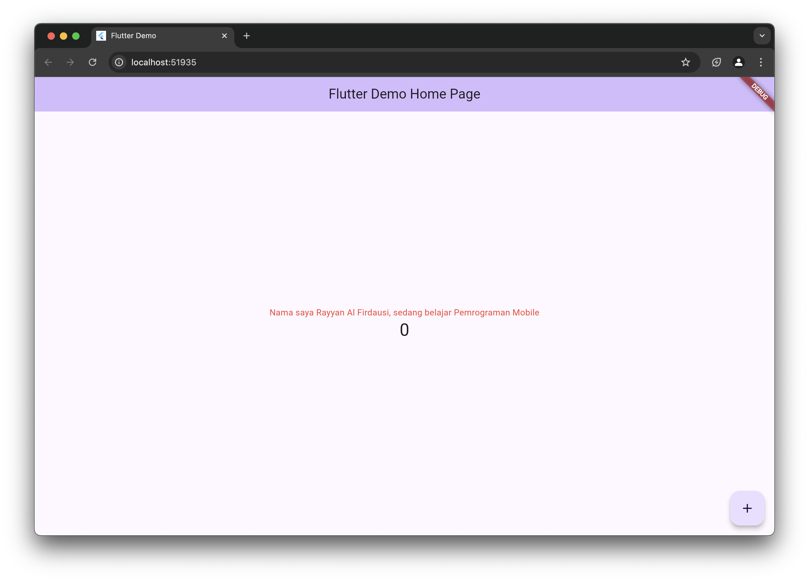
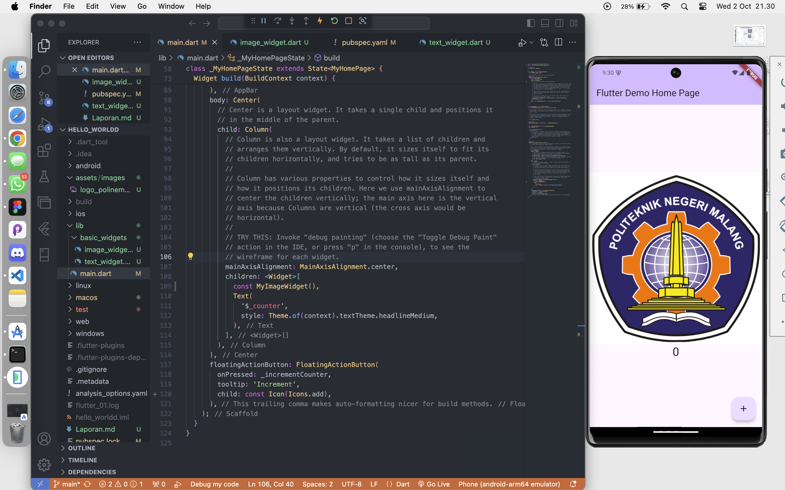
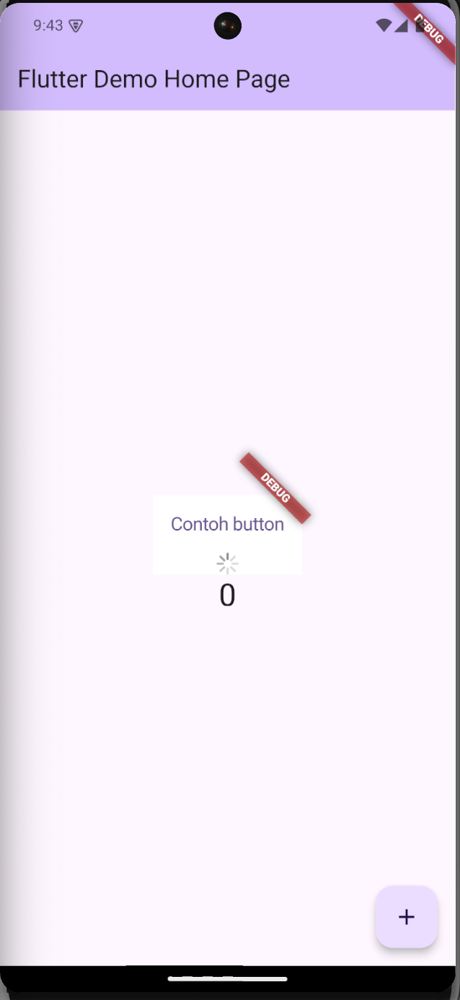
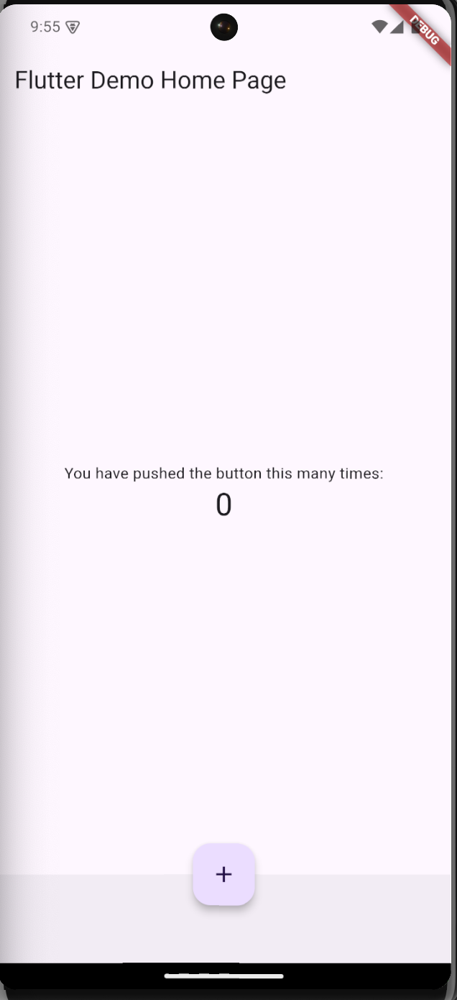
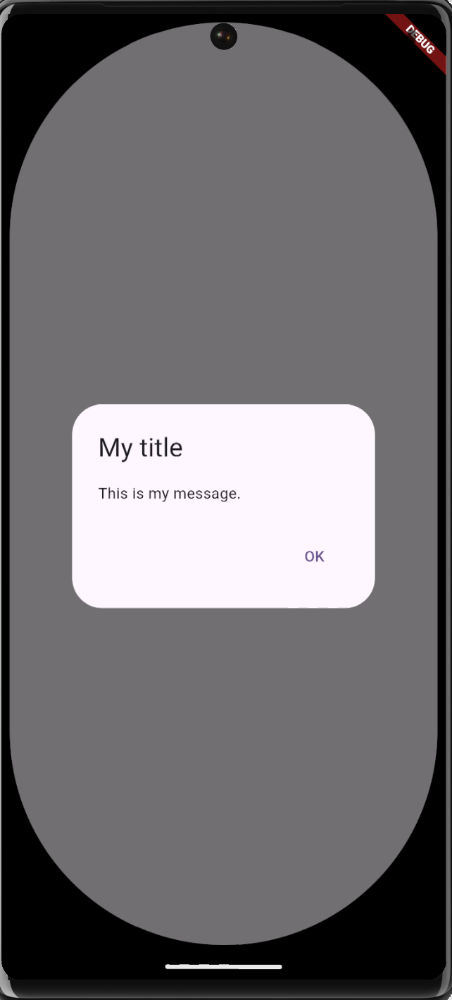
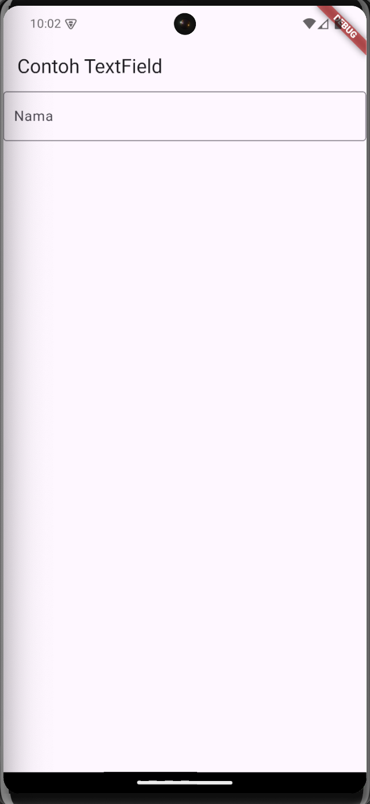
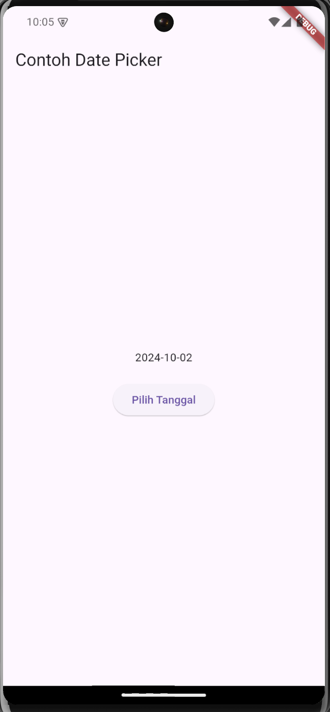

# Tugas Praktikum
### Nama : Rayyan Al Firdausi
### NIM : 2241720256
### Kelas : TI-3G (23)

## Praktikum 4
```dart
// Langkah 1
import 'package:flutter/material.dart';

class MyTextWidget extends StatelessWidget {
  const MyTextWidget({Key? key}) : super(key: key);

  @override
  Widget build(BuildContext context) {
    return const Text(
      "Nama saya Rayyan Al Firdausi, sedang belajar Pemrograman Mobile",
      style: TextStyle(color: Colors.red, fontSize: 14),
      textAlign: TextAlign.center);
  }
}
```
### Output


```dart
// Langkah 2
import 'package:flutter/material.dart';

class MyImageWidget extends StatelessWidget {
  const MyImageWidget({super.key});

  @override
  Widget build(BuildContext context) {
    return const Image(image: AssetImage("assets/images/logo_polinema.jpg"));
  }
}
```
### Output


## Praktikum 5
```dart
// Langkah 1
import 'package:flutter/cupertino.dart';
import 'package:flutter/material.dart';

class MyLoadingCupertino extends StatelessWidget {
  const MyLoadingCupertino({super.key});

  @override
  Widget build(BuildContext context) {
    return MaterialApp(
      home: Container(
        margin: const EdgeInsets.only(top: 30),
        color: Colors.white,
        child: Column(
          children: <Widget>[
            CupertinoButton(
              child: const Text("Contoh button"),
              onPressed: () {},
            ),
            const CupertinoActivityIndicator(),
          ],
        ),
      ),
    );
  }
}
```
### Output


```dart
// Langkah 2
import 'package:flutter/material.dart';

class MyFabWidget extends StatelessWidget {
  const MyFabWidget({super.key});

  @override
  Widget build(BuildContext context) {
    return FloatingActionButton(
      onPressed: () {
        // Add your onPressed code here!
      },
      child: const Icon(Icons.thumb_up),
      backgroundColor: Colors.pink,
    );
  }
}
```
### Output


```dart
// Langkah 3
class MyHomePage extends StatefulWidget {
  const MyHomePage({Key? key, required this.title}) : super(key: key);

  final String title;

  @override
  State<MyHomePage> createState() => _MyHomePageState();
}

class _MyHomePageState extends State<MyHomePage> {
  int _counter = 0;

  void _incrementCounter() {
    setState(() {
      _counter++;
    });
  }

  @override
  Widget build(BuildContext context) {
    return Scaffold(
      appBar: AppBar(
        title: Text(widget.title),
      ),
      body: Center(
        child: Column(
          mainAxisAlignment: MainAxisAlignment.center,
          children: <Widget>[
            const Text(
              'You have pushed the button this many times:',
            ),
            Text(
              '$_counter',
              style: Theme.of(context).textTheme.headlineMedium,
            ),
          ],
        ),
      ),
      bottomNavigationBar: BottomAppBar(
        child: Container(
          height: 50.0,
        ),
      ),
      floatingActionButton: FloatingActionButton(
        onPressed: _incrementCounter,
        tooltip: 'Increment Counter',
        child: const Icon(Icons.add),
      ),
      floatingActionButtonLocation: FloatingActionButtonLocation.centerDocked,
    );
  }
}
```
### Output


```dart
// Langkah 4
class MyApp extends StatelessWidget {
  const MyApp({Key? key}) : super(key: key);

  @override
  Widget build(BuildContext context) {
    return const MaterialApp(
      home: Scaffold(
        body: MyLayout(),
      ),
    );
  }
}

class MyLayout extends StatelessWidget {
  const MyLayout({Key? key}) : super(key: key);

  @override
  Widget build(BuildContext context) {
    return Padding(
      padding: const EdgeInsets.all(8.0),
      child: ElevatedButton(
        child: const Text('Show alert'),
        onPressed: () {
          showAlertDialog(context);
        },
      ),
    );
  }
}

showAlertDialog(BuildContext context) {
  // set up the button
  Widget okButton = TextButton(
    child: const Text("OK"),
    onPressed: () {
      Navigator.pop(context);
    },
  );

  // set up the AlertDialog
  AlertDialog alert = AlertDialog(
    title: const Text("My title"),
    content: const Text("This is my message."),
    actions: [
      okButton,
    ],
  );

  // show the dialog
  showDialog(
    context: context,
    builder: (BuildContext context) {
      return alert;
    },
  );
}
```
### Output


```dart
// Langkah 5
class MyApp extends StatelessWidget {
  const MyApp({Key? key}) : super(key: key);

  @override
  Widget build(BuildContext context) {
    return MaterialApp(
      home: Scaffold(
        appBar: AppBar(title: const Text("Contoh TextField")),
        body: const TextField(
          obscureText: false,
          decoration: InputDecoration(
            border: OutlineInputBorder(),
            labelText: 'Nama',
          ),
        ),
      ),
    );
  }
}
```
### Output 


```dart
// Langkah 6
import 'dart:async';
import 'package:flutter/material.dart';

void main() => runApp(const MyApp());

class MyApp extends StatelessWidget {
  const MyApp({Key? key}) : super(key: key);

  @override
  Widget build(BuildContext context) {
    return const MaterialApp(
      title: 'Contoh Date Picker',
      home: MyHomePage(title: 'Contoh Date Picker'),
    );
  }
}

class MyHomePage extends StatefulWidget {
  const MyHomePage({Key? key, required this.title}) : super(key: key);

  final String title;

  @override
  _MyHomePageState createState() => _MyHomePageState();
}

class _MyHomePageState extends State<MyHomePage> {
  // Variable/State untuk mengambil tanggal
  DateTime selectedDate = DateTime.now();

  //  Initial SelectDate FLutter
  Future<void> _selectDate(BuildContext context) async {
    // Initial DateTime FIinal Picked
    final DateTime? picked = await showDatePicker(
        context: context,
        initialDate: selectedDate,
        firstDate: DateTime(2015, 8),
        lastDate: DateTime(2101));
    if (picked != null && picked != selectedDate) {
      setState(() {
        selectedDate = picked;
      });
    }
  }

  @override
  Widget build(BuildContext context) {
    return Scaffold(
      appBar: AppBar(
        title: Text(widget.title),
      ),
      body: Center(
        child: Column(
          mainAxisSize: MainAxisSize.min,
          children: <Widget>[
            Text("${selectedDate.toLocal()}".split(' ')[0]),
            const SizedBox(
              height: 20.0,
            ),
            ElevatedButton(
              onPressed: () => {
                _selectDate(context),
                // ignore: avoid_print
                print(selectedDate.day + selectedDate.month + selectedDate.year)
              },
              child: const Text('Pilih Tanggal'),
            ),
          ],
        ),
      ),
    );
  }
}
```
